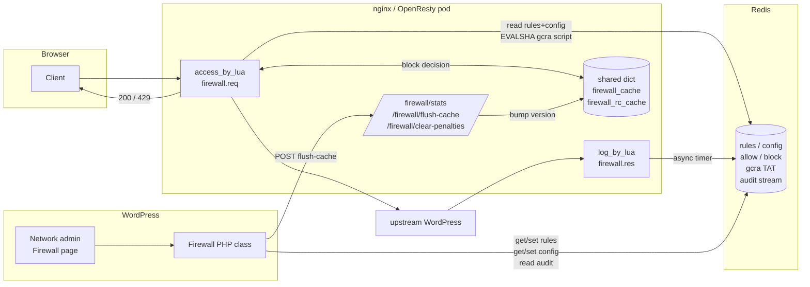
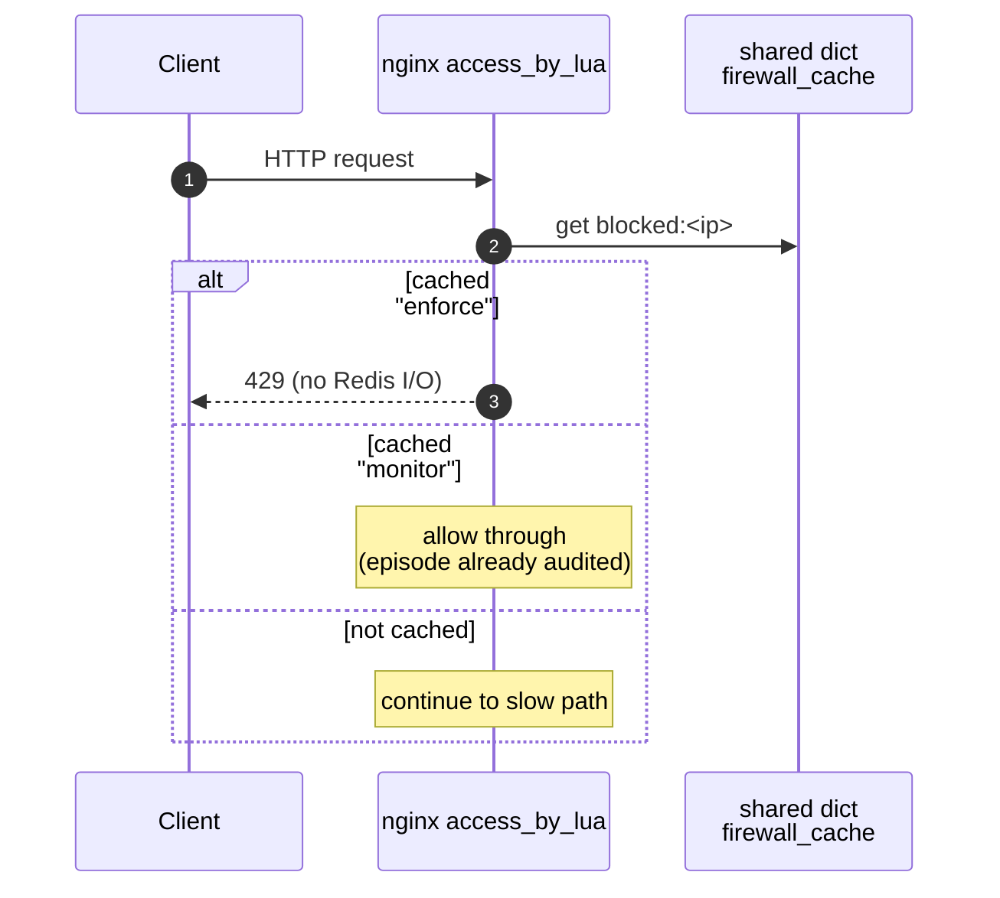
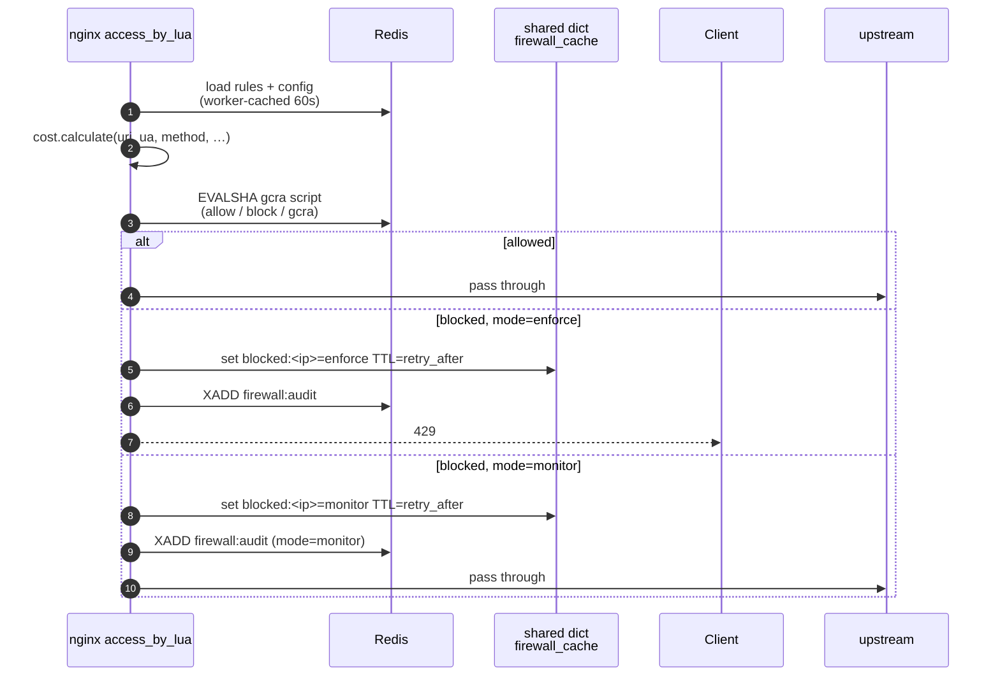
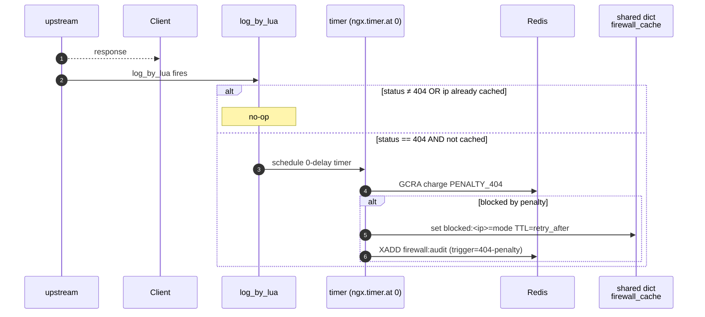

# Hale Firewall

Per-IP request rate limiting that runs inside nginx (OpenResty) and shares
state via Redis. Rules and config are edited from WordPress admin; decisions
are taken on the request hot path in Lua; an audit stream records what was
blocked and why.

This README is the **single source of truth** for how the firewall is wired
together. Per-file headers may go into more depth on particular concerns,
but if you only read one document, read this one.

---

## Contents

1. [What it does](#what-it-does)
2. [Architecture at a glance](#architecture-at-a-glance)
3. [Request flow](#request-flow)
4. [Data model (Redis keys)](#data-model-redis-keys)
5. [Operating modes](#operating-modes)
6. [File map](#file-map)
7. [How to operate](#how-to-operate)
8. [How to test](#how-to-test)
9. [Design decisions](#design-decisions)

---

## What it does

For every incoming HTTP request:

1. Look up the client IP in a small in-nginx cache. If we already decided to
   block it within a recent window, short-circuit (no Redis hit).
2. Otherwise, score the request against a list of **rules** (patterns on
   URI, User-Agent, method, query string) loaded from Redis. Each matching
   rule contributes a **cost**.
3. Run **GCRA** (a token-bucket rate limit) in a Redis Lua script, charging
   the IP that cost. Allowlists and blocklists short-circuit inside the same
   script.
4. Allow the request, or return 429. In `monitor` mode, log the would-block
   decision and let the request through.
5. After the response, if it was a 404, schedule an extra penalty cost
   asynchronously (probing for vulnerable URLs is expensive).

The point of GCRA over a naïve counter is that it handles decay naturally
and does not have the "TTL refresh" bug where a slow attacker can accumulate
score forever.

---

## Architecture at a glance



**Three independent processes share state through Redis:**

| Process | Role | Lives in |
|---|---|---|
| nginx (Lua) | Request hot path: scoring, rate-limit, block | `opt/lua/` |
| WordPress (PHP) | Admin UI: edit rules/config, view audit | `dev/mu-plugins/hale-components/inc/firewall.php` |
| Redis | Shared state | external (ElastiCache in prod, container locally) |

Redis is the **only** coupling between Lua and PHP. They never talk
directly; the schema in [firewall/config.lua](firewall/config.lua) is the
contract.

---

## Request flow

The hot path splits naturally into three stages. Each diagram covers one
stage; together they describe the full lifecycle of a request through the
firewall.

### 1. Fast path — cached decisions (zero Redis I/O)

Every request first consults the per-worker shared dict `firewall_cache`.
If this IP triggered a block within its cooldown window, the decision has
already been made and we short-circuit without touching Redis.



The cached *value* is the mode (`enforce` or `monitor`) that decided the
original block, not a boolean. That is what lets monitor mode skip the
audit on subsequent hits without re-reading config from Redis.

### 2. Slow path — score, rate-limit, decide

If the fast path didn't short-circuit, the request is scored against rules
loaded from Redis (with a 60 s per-worker cache) and a single atomic
GCRA Lua script runs server-side in Redis. The script also checks the
allow/block lists in the same round-trip.



A block writes exactly one audit entry and one cache entry per episode per
IP. Subsequent requests within the cooldown window land back on the fast
path and never reach this stage.

### 3. Response phase — 404 penalty (deferred)

After nginx finishes responding, `log_by_lua` fires. For 404 responses
only, an extra GCRA charge is applied — probing for vulnerable URLs is
expensive, so we make the attacker pay for it. `log_by_lua` cannot do
socket I/O directly, so the work is deferred into a 0-delay timer.



The penalty runs through the same GCRA path as a normal request, so it
participates in the same bucket arithmetic and respects the same mode.

---

## Data model (Redis keys)

| Key | Type | Owner writes | Owner reads | Purpose |
|---|---|---|---|---|
| `firewall:rules` | JSON string | PHP | Lua | Array of scoring rules |
| `firewall:config` | JSON string | PHP | Lua | GCRA params, mode, audit settings |
| `firewall:allow:{ip}` | string `"1"` | PHP/CLI | Lua script | Allowlist (bypass GCRA entirely) |
| `firewall:block:{ip}` | string (`"1"` manual, `"gcra"` auto) | PHP/CLI + Lua | Lua script | Blocklist; TTL = ban duration |
| `gcra:{ip}` | string (TAT, ms epoch) | Lua script | Lua script | GCRA bucket state |
| `gcra:{ip}:breakdown` | hash | Lua script | Lua script | Per-rule hit counts (audit only) |
| `firewall:audit` | stream | Lua | PHP | Decision log, capped by `audit_maxlen` |

The schema for `firewall:rules` and `firewall:config` is documented in the
header of [firewall/config.lua](firewall/config.lua) — that file is the
authoritative schema reference.

---

## Operating modes

There are **two switches** that affect whether the firewall runs:

| Switch | Where | Effect | Use when |
|---|---|---|---|
| `FIREWALL_ENABLED` env var | nginx pod | When `false`, `req()` and `res()` return immediately. Zero overhead. | Emergency kill-switch; needs nginx restart to flip. |
| `firewall:config.mode` | Redis | `enforce` blocks, `monitor` logs only, `off` skips GCRA but still runs the Lua module. | Normal operation; flips cluster-wide within 60 s (or instantly via `/firewall/flush-cache`). |

**Mode precedence:** if `FIREWALL_ENABLED=false`, nothing runs regardless
of `mode`. Otherwise `mode` takes effect.

**Why `monitor` shares the block cache with `enforce`:** so that the GCRA
bucket evolves identically under both modes, which is what makes monitor an
accurate predictor of what enforce *would* do. See the function-header
comment on `_M.req` in [firewall.lua](firewall.lua) for the full reasoning.

---

## File map

### Lua (`opt/lua/`)

| File | Responsibility |
|---|---|
| [firewall.lua](firewall.lua) | Orchestrator. Exports `init/req/res/stats/flush_cache/validate/seed_rules/allow_ip/block_ip/clear_penalties`. Called by nginx phases. |
| [firewall/cost.lua](firewall/cost.lua) | Pure function — score a request against rules. No `ngx.*` deps; unit-testable. |
| [firewall/gcra.lua](firewall/gcra.lua) | GCRA algorithm + the Redis Lua script that runs server-side. EVALSHA + cache. |
| [firewall/config.lua](firewall/config.lua) | Pure validators for `firewall:rules` and `firewall:config`. **Authoritative schema lives here.** Exposes `parse_*` (fail-soft, runtime) and `validate_*_strict` (fail-hard, admin path). |
| [firewall/redis.lua](firewall/redis.lua) | Connection pool, fail-open. Reads `REDIS_*` env. |
| [spec/](spec/) | busted unit + integration tests (run with `make test-firewall`). |
| [firewall_e2e_test.js](firewall_e2e_test.js) | Node/Deno e2e tests + CSV fixture replay against a running stack. |
| [fixtures/](fixtures/) | CSV replay inputs from Ingress log exports. |

### nginx (`opt/nginx/`)

| File | Responsibility |
|---|---|
| `nginx.conf` | `lua_package_path`, shared dicts, `init_worker_by_lua_block`, `env FIREWALL_ENABLED`, log format. |
| `wordpress.conf` | Production server block. `access_by_lua_block { firewall.req() }`, `log_by_lua_block { firewall.res() }`, admin endpoints. |
| `localwordpress.conf` | Local-dev equivalent. |

### PHP (`dev/mu-plugins/hale-components/inc/`)

| File | Responsibility |
|---|---|
| `firewall.php` | `Firewall` class: form handlers, Redis client, audit reader. Delegates schema validation to `/firewall/admin/validate`. |
| `parts/firewall-status.php` | The admin view rendered on the network dashboard. |

---

## How to operate

### Change rules or config

WordPress admin → Network dashboard → Firewall section. Edit JSON, save.
The form POSTs the payload to `/firewall/admin/validate?kind=rules|config`
first — the Lua schema in [firewall/config.lua](firewall/config.lua) is the
single source of truth, so any error you see in the admin form is the
same error the runtime parser would log. On success PHP writes the
*normalised* payload to Redis (defaults applied, types coerced) and calls
`/firewall/flush-cache` so all nginx workers re-read on their next
request (otherwise it takes up to 60 s).

### Allow or block an IP

There is no admin UI for these yet. From inside the nginx container:

```lua
require("firewall").allow_ip("1.2.3.4", 3600)   -- 1 hour
require("firewall").block_ip("1.2.3.4", nil)    -- permanent
require("firewall").unblock_ip("1.2.3.4")
```

Or directly in Redis:

```
SET firewall:allow:1.2.3.4 1 EX 3600
SET firewall:block:1.2.3.4 1            # permanent manual ban
DEL firewall:allow:1.2.3.4
```

### Inspect state

| What | How |
|---|---|
| Current rules/config + active GCRA TATs | `GET /firewall/stats` (returns JSON) |
| Dry-run schema check on a payload | `POST /firewall/admin/validate?kind=rules\|config` with the JSON body |
| Recent decisions | WordPress admin → audit table, or `XREVRANGE firewall:audit + - COUNT 50` |
| Currently active blocks | `KEYS firewall:block:*` then `PTTL` per key |
| nginx access log | `fw_cost=N` field on every line shows the rule total |

### Flip mode without a deploy

```
SET firewall:config '{"mode":"enforce", ...}'
GET /firewall/flush-cache              # propagate immediately to all workers
```

### Clear automatic penalties (manual bans untouched)

```
GET /firewall/clear-penalties
```

### Disable everything immediately

Set `FIREWALL_ENABLED=false` in the nginx Helm values and redeploy. This is
the only switch that requires a restart.

---

## How to test

### Unit + integration (busted, fast, in-container)

```
make test-firewall
```

Builds the `test` stage of [nginx.local.dockerfile](../../nginx.local.dockerfile),
runs busted with `REDIS_DB=1` against the dev Redis container so it does
not collide with anything live.

### End-to-end (Node or Deno, slow, against a running stack)

Bring the stack up with the firewall enabled:

```
make run-with-firewall
```

Then:

```
node --test opt/lua/firewall_e2e_test.js
# or
deno test --allow-net="hale.docker" --allow-read=./fixtures \
  --unsafely-ignore-certificate-errors opt/lua/firewall_e2e_test.js
```

Drop a CSV from Cloud Platform ingress logs into [fixtures/](fixtures/) 
to replay real traffic against the firewall — the test discovers them
automatically.

---

## Design decisions

These are recorded here rather than scattered through file headers.

### Why GCRA, not a sliding-window counter

A counter that's bumped on each request and given a TTL has a refresh bug:
every hit pushes the TTL out, so a slow attacker keeps the counter alive
forever and accumulates unbounded score. GCRA stores a *theoretical
arrival time* instead — there is no "score" to refresh, only a moving
deadline. Decay is implicit.

Further reading:
- [Generic cell rate algorithm (Wikipedia)](https://en.wikipedia.org/wiki/Generic_cell_rate_algorithm)
  — the original spec; explains TAT, emission interval, and the
  leaky-bucket equivalence.
- [Distributed Rate Limiter with Redis & Lua | GCRA Algorithm Demo (YouTube)](https://www.youtube.com/watch?v=HqAjClwTBy0)
  — walks through the same Redis+Lua pattern used in [firewall/gcra.lua](firewall/gcra.lua).

### Why both modes share `firewall_cache`

Three reasons, in order of importance:

1. **Symmetry with enforce.** In enforce mode, blocked requests don't reach
   Redis (fast-path 429). The GCRA bucket only sees *allowed* traffic. If
   monitor mode behaved differently — every request reaches Redis — the
   bucket diverges and monitor becomes a poor predictor of enforce. They
   must share the cache to share GCRA semantics.
2. **Performance parity.** Without the cache, monitor mode pays one Redis
   round-trip per attack request. That makes monitor too expensive to leave
   on, defeating its purpose as a safe-rollout mode.
3. **Audit volume.** With the cache, audit is "one entry per block episode
   per IP" in both modes. Without it, monitor would write thousands of
   duplicate rows during a single attack.

The cached *value* is the mode that decided the block (`enforce` /
`monitor`), not a boolean. A mode flip mid-window therefore does not
retroactively change cached entries — they keep behaving as their original
mode said until the TTL expires. Use `/firewall/flush-cache` for an
immediate cluster-wide reset.

### Why the 404 penalty runs in a timer

`log_by_lua` does not allow socket I/O — the request is finished. We
schedule a 0-delay timer because timer contexts *do* allow sockets. The
penalty is applied via the same GCRA path as a normal request, so it
participates in the same bucket arithmetic.

### Fail-open everywhere

If Redis is unreachable, `redis.connect()` returns `nil` and every caller
returns early. The site stays up; the firewall is effectively off until
Redis returns. This is preferred over fail-closed because a Redis outage
should not be a site outage.

### Per-worker rules cache + cross-worker version counter

Each nginx worker caches decoded rules/config for 60 s. A shared-dict
counter lets `/firewall/flush-cache` invalidate all workers at once: each
worker compares the version on its next request and re-reads if it
changed. Without this, a config change would propagate worker-by-worker
over up to 60 s with stale and fresh requests interleaved.

### Schema validation lives in Lua, exposed over HTTP

The schema for `firewall:rules` and `firewall:config` is defined once in
[firewall/config.lua](firewall/config.lua). The WordPress admin form
posts the operator's input to `POST /firewall/admin/validate?kind=rules`
(or `kind=config`) and uses the JSON response (`ok`, `errors`,
`normalised`) to decide whether to write to Redis.

Why an HTTP endpoint instead of a duplicated PHP validator:

- **Single source of truth.** A type or default added in Lua is picked
  up by the admin form on the next request — no parallel PHP validator
  to keep in sync, no schema-drift class of bug.
- **Same parser as the runtime.** The endpoint runs the exact functions
  that read from Redis at request time, wrapped to fail hard instead of
  fail soft. If the runtime would warn-and-skip a rule, the admin sees
  it as an error before save.
- **Read-only and cheap.** No Redis writes, no side effects; restricted
  to loopback in production by the same nginx ACL as the other
  `/firewall/*` admin endpoints.

What this design intentionally does *not* do (yet):

- It does not move Redis writes into nginx. PHP still owns the `SET` and
  the follow-up call to `/firewall/flush-cache`. A future phase could
  fold validate + write + flush into a single atomic admin endpoint, but
  that change has more surface area for less marginal value than killing
  the duplicated validator does.
- It does not move runtime reads off PHP. The PHP class still talks
  directly to Redis for the admin "current value" display. Same reason:
  removing the duplicated *validation* code is the high-value change;
  removing the duplicated *read* path is a larger refactor for a
  smaller win.
