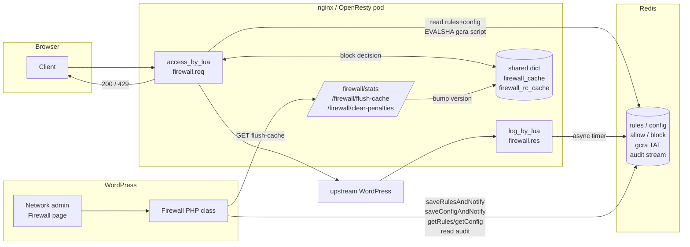
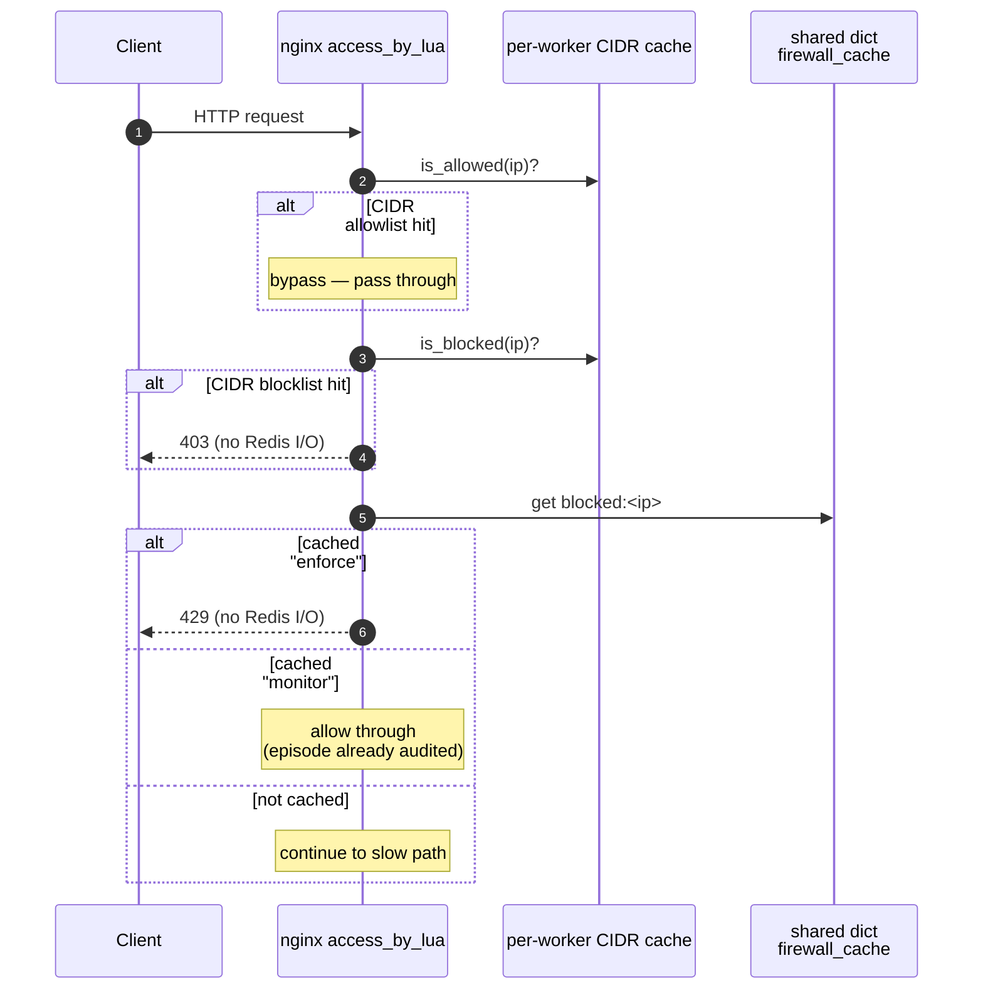
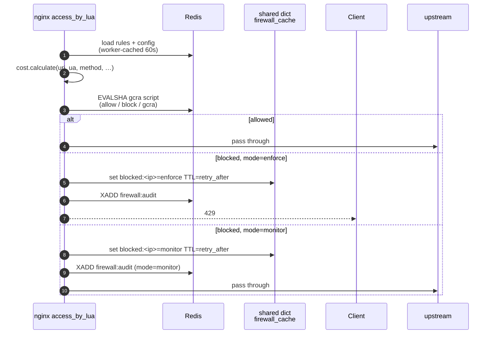
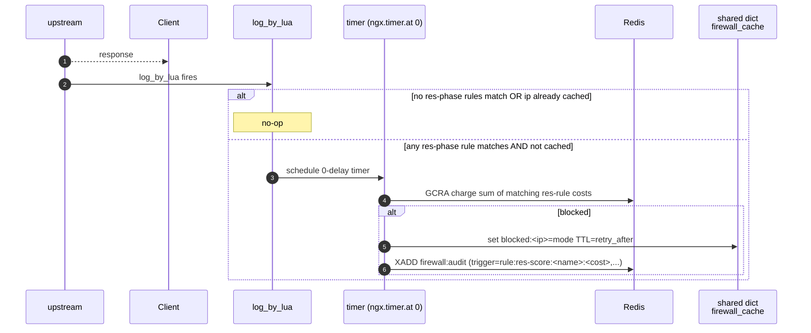

# Hale Firewall

Per-IP request rate limiting that runs inside nginx (OpenResty) and shares
state via Redis. Rules and config are edited from WordPress admin; decisions
are taken on the request hot path in Lua; an audit stream records what was
blocked and why.

This README is the **single source of truth** for how the firewall is wired
together. Per-file headers may go into more depth on particular concerns,
but if you only read one document, read this one.

---

## Contents

1. [What it does](#what-it-does)
2. [The firewall contract](#the-firewall-contract)
3. [Architecture at a glance](#architecture-at-a-glance)
4. [Request flow](#request-flow)
5. [Data model (Redis keys)](#data-model-redis-keys)
6. [Operating modes](#operating-modes)
7. [Logging](#logging)
8. [File map](#file-map)
9. [How to operate](#how-to-operate)
10. [How to test](#how-to-test)
11. [Design decisions](#design-decisions)

---

## What it does

For every incoming HTTP request:

1. Check the client IP against the **CIDR allowlist** (`firewall:allowlist`).
   If it matches, bypass all firewall logic and pass through.
2. Check the client IP against the **CIDR blocklist** (`firewall:blocklist`).
   If it matches, return 403 immediately — no scoring, no GCRA.
3. Look up the client IP in a small in-nginx cache. If we already decided to
   block it within a recent window, short-circuit (no Redis hit).
4. Otherwise, score the request against a list of **rules** (patterns on
   URI, User-Agent, method, query string) loaded from Redis. Each matching
   rule contributes a **cost**.
5. Run **GCRA** (a token-bucket rate limit) in a Redis Lua script, charging
   the IP that cost. Per-IP allow/block keys short-circuit inside the same
   script.
6. Allow the request, or return 429. In `monitor` mode, log the would-block
   decision and let the request through.
7. After the response, if any `res`-phase rules match, schedule an extra
   charge asynchronously (e.g. a 404 penalty for path probing).

The point of GCRA over a naïve counter is that it handles decay naturally
and does not have the "TTL refresh" bug where a slow attacker can accumulate
score forever.

---

## The firewall contract

Four separate codebases (nginx Lua, WordPress PHP, nginx config, busted/e2e
tests) cooperate without ever calling each other directly. They agree on
four things, listed here so each is documented in exactly one place. Any
change to these is a breaking change — update this section first.

### 1. HTTP endpoints (`/firewall/*`)

All dispatched by `firewall.admin.handle_route()` in [firewall/admin.lua](firewall/admin.lua).
Access is restricted to loopback in production by a single `location ^~
/firewall/` block.

| Method | Path | Purpose | Caller |
|---|---|---|---|
| `GET`  | `/firewall/stats`            | JSON snapshot of rules, config, and live GCRA TATs | Ops, debug |
| `GET`  | `/firewall/flush-cache`      | Bump shared version counter so all workers re-read rules/config; clears local block cache | PHP after every save; ops after manual Redis edits |
| `GET`  | `/firewall/clear-penalties`  | Delete every `firewall:block:{ip}` whose value is `"gcra"` (manual bans untouched) | Ops |
| `POST` | `/firewall/admin/validate?kind=rules\|config\|allowlist\|blocklist` | Strict schema check, body is the candidate JSON; **read-only, no Redis writes** | PHP admin form before save |

### 2. Redis keys

See [Data model](#data-model-redis-keys) below for the full table. Key
names are pinned as constants in [firewall/defaults.lua](firewall/defaults.lua):
`GCRA_KEY_PREFIX`, `ALLOW_KEY_PREFIX`, `BLOCK_KEY_PREFIX`, `AUDIT_STREAM`.
PHP hardcodes the same strings; if you rename one, update both sides.

### 3. Audit stream fields (`firewall:audit`)

Written by `firewall.req()` (request-time blocks) and the `firewall.res()`
response-phase timer. Read by the WordPress admin audit table.

| Field | Type | Always present | Meaning |
|---|---|---|---|
| `ip`           | string  | yes | Client IP that triggered the block |
| `blocked_at`   | int (ms epoch) | yes | When the block decision was taken |
| `cost`         | int  | yes | GCRA cost charged on this request |
| `mode`         | string  | yes | `enforce` or `monitor` — mode in force at the moment of the block |
| `trigger`      | string  | yes | What caused the block: `blocklist`, `penalty`, or comma-separated `rule:<phase>-score:<name>:<cost>` pairs (e.g. `rule:req-score:php-probe:20`, `rule:res-score:res-404:50`) |
| `accumulated`  | JSON object string | yes | Per-rule hit counts accumulated in the GCRA breakdown hash at the moment of the block (e.g. `{"php-probe":3,"high-ua":1}`). `""` when the breakdown hash is empty or Redis returned nil (e.g. `blocklist`/`penalty` blocks, or audit disabled). |
| `reason`       | string  | request only | `block` / `penalty` / `gcra` — which arm of the GCRA script fired (omitted on response-phase entries) |
| `retry_after`  | int (ms) | request only | Suggested cooldown for the client; same value used for the local cache TTL |

The stream is capped by `XADD MAXLEN ~ audit_maxlen` (default 10 000,
tunable via `firewall:config.audit_maxlen`).

### 4. Validate response shape

`POST /firewall/admin/validate` always returns `200 application/json` with
this exact shape, regardless of whether validation succeeded:

```json
{
  "ok": true,
  "errors": [],
  "normalised": [ /* rules array */ ] | { /* config object */ } | null
}
```

- `ok`: `true` only if every rule / every config field passed strict
  validation **and** (for rules) every PCRE pattern compiled.
- `errors`: human-readable strings, one per problem found. Empty when `ok`.
- `normalised`: the payload as it would be persisted to Redis — defaults
  applied, types coerced, unknown keys stripped. `null` when `ok` is
  `false`. PHP writes this verbatim to Redis on success; never the raw
  operator input. For `allowlist` and `blocklist` kinds this is a JSON
  array of strings (CIDR notation, e.g. `["10.0.0.0/8", "192.168.1.5"]`);
  bare IPs are accepted and stored as-is (treated as /32 at match time).

A non-200 response indicates a request-shape problem (missing `kind`,
empty body, malformed JSON), not a schema problem.

---

## Architecture at a glance



**Three independent processes share state through Redis:**

| Process | Role | Lives in |
|---|---|---|
| nginx (Lua) | Request hot path: scoring, rate-limit, block | `opt/lua/` |
| WordPress (PHP) | Admin UI: edit rules/config, view audit | `dev/mu-plugins/hale-components/inc/firewall.php` |
| Redis | Shared state | external (ElastiCache in prod, container locally) |

Redis is the **only** coupling between Lua and PHP. They never talk
directly; the schema in [firewall/schema.lua](firewall/schema.lua) is the
contract.

---

## Request flow

The hot path splits naturally into three stages. Each diagram covers one
stage; together they describe the full lifecycle of a request through the
firewall.

### 1. Fast path — cached decisions (zero Redis I/O)

Every request first consults the per-worker shared dict `firewall_cache`.
If this IP triggered a block within its cooldown window, the decision has
already been made and we short-circuit without touching Redis.



The cached *value* is the mode (`enforce` or `monitor`) that decided the
original block, not a boolean. That is what lets monitor mode skip the
audit on subsequent hits without re-reading config from Redis.

### 2. Slow path — score, rate-limit, decide

If the fast path didn't short-circuit, the request is scored against rules
loaded from Redis (with a 60 s per-worker cache) and a single atomic
GCRA Lua script runs server-side in Redis. The script also checks the
allow/block lists in the same round-trip.



A block writes exactly one audit entry and one cache entry per episode per
IP. Subsequent requests within the cooldown window land back on the fast
path and never reach this stage.

### 3. Response phase — 404 penalty (deferred)

After nginx finishes responding, `log_by_lua` fires. For 404 responses
only, an extra GCRA charge is applied — probing for vulnerable URLs is
expensive, so we make the attacker pay for it. `log_by_lua` cannot do
socket I/O directly, so the work is deferred into a 0-delay timer.



The response-phase charge runs through the same GCRA path as a normal
request, so it participates in the same bucket arithmetic and respects
the same mode.

---

## Data model (Redis keys)

| Key | Type | Owner writes | Owner reads | Purpose |
|---|---|---|---|---|
| `firewall:rules` | JSON string | PHP | Lua | Array of scoring rules |
| `firewall:config` | JSON string | PHP | Lua | GCRA params, mode, audit settings |
| `firewall:allowlist` | JSON string | PHP/CLI | Lua | Array of IPv4 CIDR strings (or bare IPs) that bypass all firewall logic |
| `firewall:blocklist` | JSON string | PHP/CLI | Lua | Array of IPv4 CIDR strings (or bare IPs) that receive an immediate 403 |
| `firewall:allow:{ip}` | string `"1"` | PHP/CLI | Lua script | Per-IP bypass flag (checked inside GCRA script) |
| `firewall:block:{ip}` | string (`"1"` manual, `"gcra"` auto) | PHP/CLI + Lua | Lua script | Per-IP block flag; TTL = ban duration |
| `firewall:gcra:{ip}` | string (TAT, ms epoch) | Lua script | Lua script | GCRA bucket state |
| `firewall:gcra:{ip}:breakdown` | hash | Lua script | Lua script | Per-rule hit counts (audit only) |
| `firewall:audit` | stream | Lua | PHP | Decision log, capped by `audit_maxlen` |

The schema for `firewall:rules` and `firewall:config` is documented in the
header of [firewall/schema.lua](firewall/schema.lua) — that file is the
authoritative schema reference.

### Rule schema (summary)

Each entry in `firewall:rules` is `{name, phase, cost, match}`:

- **`name`** — required, `[a-z0-9-]{1,64}`, unique within the array. Used
  as the audit trigger identity (`rule:<phase>-score:<name>:<cost>`).
- **`phase`** — required, `"req"` (evaluated in `access_by_lua`) or
  `"res"` (evaluated in `log_by_lua`).
- **`cost`** — required integer in `0..99999`. `0` = audit-only (matches
  appear in the breakdown but add no tokens); a value `>=` bucket
  capacity guarantees a block on first match.
- **`match`** — required object, at least one predicate. Predicate keys
  are phase-specific:
  - **req** — `uri_pattern` / `ua_pattern` / `query_pattern` (PCRE,
    case-insensitive), `method` (exact, case-sensitive), `has_query`
    (boolean). Predicates within a rule are AND'd.
  - **res** — `status` (integer 100–599).

There is **no separate action enum**: every rule contributes to the
single per-IP GCRA bucket, and the bucket is the only blocking
mechanism. Operators tune behaviour via `cost` (0 → audit, large →
guaranteed block).

An empty `firewall:rules` array means no scoring is applied — by design,
this is a "no firewall" deployment. To enable scoring you must seed
rules.

---

## Operating modes

There are **two switches** that affect whether the firewall runs:

| Switch | Where | Effect | Use when |
|---|---|---|---|
| `FIREWALL_ENABLED` env var | nginx pod | When `false`, `req()` and `res()` return immediately. Zero overhead. | Emergency kill-switch; needs nginx restart to flip. |
| `firewall:config.mode` | Redis | `enforce` blocks, `monitor` logs only, `off` skips GCRA but still runs the Lua module. | Normal operation; flips cluster-wide within 60 s (or instantly via `/firewall/flush-cache`). |

**Mode precedence:** if `FIREWALL_ENABLED=false`, nothing runs regardless
of `mode`. Otherwise `mode` takes effect.

**Why `monitor` shares the block cache with `enforce`:** so that the GCRA
bucket evolves identically under both modes, which is what makes monitor an
accurate predictor of what enforce *would* do. See the function-header
comment on `_M.req` in [firewall.lua](firewall.lua) for the full reasoning.

---

## Logging

The firewall writes to **three independent destinations**. Each answers a
different operational question; together they make every decision
traceable from a single request line back to the rule that scored it.

| Destination | Where it goes | What it answers | Cardinality |
|---|---|---|---|
| nginx access log | `/dev/stdout` (pod stdout) | "What was the score on *this* request?" | One line per request |
| nginx error log  | `/dev/stderr` at `info` level (pod stderr) | "Did the firewall behave as expected, and if not, why?" | One line per event |
| Redis stream `firewall:audit` | Redis (read by WP admin) | "Which IPs got blocked, when, and what triggered it?" | One entry per block episode per IP |

### 1. nginx access log

Declared once in [nginx.conf](../nginx/nginx.conf) and applied to every
server block:

```nginx
log_format main '$remote_addr - $remote_user [$time_local] '
                '"$request" $status $body_bytes_sent '
                '"$http_referer" "$http_user_agent" '
                'fw_cost=$firewall_cost cache=$upstream_cache_status';
access_log /dev/stdout main;
```

The firewall contributes one field: **`fw_cost=N`**, the GCRA cost charged
on this request. Set in `firewall.req()` via `ngx.var.firewall_cost =
tostring(request_cost)` after rule scoring. Values:

- `fw_cost=0` — no rules matched (or firewall disabled / fast-path cache hit before scoring ran).
- `fw_cost=N` (N > 0) — sum of costs of all matching `req`-phase rules.

Response-phase (`res`) costs do **not** appear in the access log — by the
time `log_by_lua` runs, the line has already been formatted. They appear
in the audit stream and the error log instead.

### 2. nginx error log

Written via `ngx.log(level, ...)` from Lua. Goes to `/dev/stderr` at
`info` level and above (set in [nginx.conf](../nginx/nginx.conf)). Every
firewall message is prefixed `[firewall]`, `[redis]`, or `[gcra]` so
`grep '\[firewall\]' …` is the canonical way to read it.

What each level means in this codebase:

| Level | Meaning | Operator action |
|---|---|---|
| `NOTICE`  | Lifecycle / configuration events (startup, cache reload, flush) | None — confirms the system is behaving as expected |
| `INFO`    | Normal decisions — block episodes, res-phase charges | None — useful for incident post-mortems |
| `WARN`    | Something is off but the request was handled (schema problem, regex error, GCRA script fallback) | Investigate if frequent |
| `ERR`     | Internal failure; firewall failed open, or a write to the audit stream was lost | Page if sustained |

Every firewall message begins with `[firewall]` and uses a consistent
`event=<name> key=value …` format so log shippers (Fluent Bit, Loki) can
parse them without a custom regex per message type. The pattern is:

```
[firewall] event=<event> [field=value ...]
```

Complete catalogue of events, by source file:

#### [firewall.lua](firewall.lua) — request hot path

| Level | `event=` | Fields | When |
|---|---|---|---|
| `NOTICE` | `startup` | `enabled=` `redis_ssl=` | Once per nginx worker from `init()`. Confirms kill-switch and SSL config. `init()` also pre-warms the CIDR/rules cache via a Redis call so `is_allowed`/`is_blocked` have populated lists before the first request. Fail-open: if Redis is unavailable at startup the first request re-attempts via the normal `pcall` path. |
| `WARN`   | `regex_error` | `pattern=` `err=` | A rule's PCRE failed at match time. **Deduplicated:** logged at most once per hour per pattern via a shared-dict key (`logged:regex:<pattern>`, TTL 3600 s) to prevent a single bad rule flooding stderr on every request. Should never fire in production — admin validate runs `compile_check_patterns` first. Indicates a rule was written directly to Redis. |
| `ERR`    | `no_rules` | `msg=` | `firewall:rules` is missing or empty. Fail-open; firewall is effectively off until rules are seeded. |
| `INFO`   | `block` | `phase=req` `mode=` `ip=` `reason=` `cost=` `retry_after=` | Block decision (req phase). `mode=enforce` → 429 was returned; `mode=monitor` → request passed through. One entry per block episode per IP (fast-path cache deduplicates). |
| `ERR`    | `audit_write_failed` | `phase=req` `ip=` `err=` | `XADD firewall:audit` failed. The block decision was enforced correctly but the audit record was lost. |
| `ERR`    | `req_error` | `err=` | The protected `pcall` block in `req()` raised. Request was allowed through (fail-open). Almost always a Lua bug; investigate immediately. |
| `INFO`   | `block` | `phase=res` `mode=` `ip=` `status=` `cost=` `retry_after=` | Response-phase charge tripped the bucket. The current response was already sent; the *next* request from this IP hits the fast path. |
| `ERR`    | `audit_write_failed` | `phase=res` `ip=` `err=` | `XADD firewall:audit` failed in the res-phase timer. |
| `INFO`   | `res_charge` | `phase=res` `ip=` `status=` `cost=` | Res-phase rule matched and charged the bucket but did **not** block. Confirms res-rules are scoring without yet tipping the bucket. |
| `ERR`    | `res_timer_error` | `err=` | The deferred res-phase work raised inside the timer. The charge was lost; the response was already sent. |
| `ERR`    | `timer_schedule_error` | `err=` | `ngx.timer.at(0, …)` itself failed (typically out of timers). Res-phase scoring skipped entirely for this request. |

**`reason=` values** in `event=block` entries, mirroring the audit stream's
`reason` field:

- `block`   — `firewall:block:<ip>` is set (manual ban).
- `penalty` — `firewall:block:<ip>` is set with value `"gcra"` (automatic ban from a previous GCRA block).
- `gcra`    — live GCRA bucket exhausted.
- `allow`   — never logged (suppressed: an allowlisted IP is not a block event).

#### [firewall/cache.lua](firewall/cache.lua)

| Level | `event=` | Fields | When |
|---|---|---|---|
| `NOTICE` | `rules_reload` | `version=` `rule_count=` | Fired once per worker each time the per-worker cache is refreshed from Redis (either the 60 s TTL expired or `/firewall/flush-cache` bumped the version counter). Correlate `version=` across workers to confirm a config change propagated everywhere. |
| `ERR`    | `json_decode_error` | `key=` `err=` | A Redis key (`firewall:rules`, `:config`, `:allowlist`, or `:blocklist`) contained invalid JSON. The affected list is treated as empty (fail-open). Indicates a bad direct write to Redis bypassing the admin validate endpoint. |
| `WARN`   | `schema_warn` | `kind=rules\|config\|allowlist\|blocklist` + the warning text | A rule / config field / CIDR entry in Redis failed structural validation. The offending entry is dropped; the rest are kept. Should never fire in production — admin validate catches this before save. |
| `NOTICE` | `cache_flush` | `version=` | The shared version counter was bumped by `/firewall/flush-cache`. All workers will reload on their next request. `version=` is the new counter value. |
| `ERR`    | `cache_flush_error` | `err=` | The shared-dict version counter could not be incremented. Falls back to `set("version", 1)`. Indicates `firewall_rc_cache` shared dict is misconfigured. |

#### [firewall/cost.lua](firewall/cost.lua)

| Level | Message | When |
|---|---|---|
| `WARN` | `[firewall] cost.calculate skipped rule name=<n> with unknown phase=<p>` | A rule with a phase other than `req`/`res` reached the scorer. Defensive; `schema.parse_rules` already rejects this, so this only fires if rules were written directly to Redis. |

#### [firewall/redis.lua](firewall/redis.lua)

| Level | Message | When |
|---|---|---|
| `ERR` | `[redis] connect failed (fail-open): <err>` | TCP connect to Redis failed. Caller returns early; firewall behaves as if disabled until Redis returns. |
| `ERR` | `[redis] auth failed (fail-open): <err>` | `REDIS_AUTH` was set but `AUTH` was rejected. Fail-open. |
| `ERR` | `[redis] select db failed (fail-open): <err>` | `SELECT <REDIS_DB>` failed. Fail-open. |

#### [firewall/gcra.lua](firewall/gcra.lua)

| Level | Message | When |
|---|---|---|
| `WARN` | `[gcra] SCRIPT LOAD failed, falling back to EVAL: <err>` | The GCRA Lua script could not be cached server-side. The script still runs via `EVAL` (slower but functionally identical). Usually transient (Redis restart flushed the script cache). |

#### [firewall/admin.lua](firewall/admin.lua)

| Level | Message | When |
|---|---|---|
| `ERR` | `[firewall] failed to list block keys: <err>` | `KEYS firewall:block:*` failed during `/firewall/clear-penalties`. Endpoint continues with whatever keys were returned. |

### 3. Audit stream — `firewall:audit`

The structured, machine-readable record of every block decision. Written
from two places:

- `firewall.req()` — request-phase blocks (allowlist/blocklist, GCRA bucket, manual/automatic bans).
- The deferred timer in `firewall.res()` — response-phase blocks (404/499 penalty tripped the bucket).

Written with `XADD firewall:audit MAXLEN ~ <audit_maxlen> * field value …`.
The `~` makes the trim approximate (cheap); `audit_maxlen` defaults to
10 000 and is set in `firewall:config.audit_maxlen`. Writes are gated by
`firewall:config.audit_enabled` — set it to `false` to silence the stream
entirely without touching the rest of the firewall.

Fields are documented in full in
[The firewall contract → Audit stream fields](#3-audit-stream-fields-firewallaudit).
The key invariants:

- **One entry per block episode per IP.** The fast-path `firewall_cache`
  short-circuits subsequent requests within the cooldown window before
  they reach the audit code, so a 10 000-request burst from one IP
  produces one row, not 10 000.
- **`mode` is captured at write time**, not read time. Audit reflects what
  the firewall did — flipping `mode` later does not rewrite history.
- **Monitor mode writes audit entries** the same way enforce does. That
  is the whole point of monitor: see what enforce *would* have done.
- **`trigger` is sorted** so the same matching rule set always produces
  the same string, making `XREVRANGE` output diff-able across requests.

Read it from the WordPress admin (Network dashboard → Firewall → audit
table) or directly:

```
XREVRANGE firewall:audit + - COUNT 50
XLEN firewall:audit
```

### Quick reference — "why was this request blocked?"

Given a 429 response, walk these in order:

1. **Access log** for the request: confirm `fw_cost=N` (req-phase score).
2. **Audit stream** filtered to the IP: `XREVRANGE firewall:audit + - COUNT 100` then grep. The `trigger`, `reason`, and `cost` fields fully explain the decision.
3. **Error log** filtered to the IP: `grep 'event=block.*ip=<ip>'` shows the corresponding INFO line and any preceding ERR (e.g. `event=audit_write_failed` means the audit row may be missing).

---

## File map

### Lua (`opt/lua/`)

| File | Responsibility |
|---|---|
| [firewall.lua](firewall.lua) | **Hot path only.** Exports `init`, `req`, `res`. Called by `init_worker_by_lua_block`, `access_by_lua_block`, `log_by_lua_block`. |
| [firewall/admin.lua](firewall/admin.lua) | Admin endpoints. Exports `handle_route`, `stats`, `flush_cache`, `validate`, `clear_penalties`. Called by `content_by_lua_block` in the `/firewall/*` location. |
| [firewall/cache.lua](firewall/cache.lua) | Shared cache state: `blocked_cache` (shared dict), `load_rules_and_config` (per-worker TTL cache), `flush`. Required by both `firewall` and `firewall.admin`. |
| [firewall/cost.lua](firewall/cost.lua) | Pure function — score a request against rules. No `ngx.*` deps; unit-testable. |
| [firewall/gcra.lua](firewall/gcra.lua) | GCRA algorithm + the Redis Lua script that runs server-side. EVALSHA + cache. |
| [firewall/schema.lua](firewall/schema.lua) | Pure validators for `firewall:rules` and `firewall:config`. **Authoritative schema lives here.** Exposes `parse_*` (fail-soft, runtime) and `validate_*_strict` (fail-hard, admin path). |
| [firewall/defaults.lua](firewall/defaults.lua) | Single source of truth for constants (`GCRA_KEY_PREFIX` etc.) and GCRA tunable defaults. |
| [firewall/cidr.lua](firewall/cidr.lua) | Pure IPv4 CIDR matching. No `ngx.*` deps; unit-testable. `parse(entry)` → `{net, host_count}` or nil. `contains(parsed_list, ip)` → bool. Bare IPs treated as /32. |
| [firewall/redis.lua](firewall/redis.lua) | Connection pool, fail-open. Reads `REDIS_*` env. |
| [spec/](spec/) | busted unit + integration tests (run with `make test-firewall`). |
| [firewall_e2e_test.js](firewall_e2e_test.js) | Node/Deno e2e tests + CSV fixture replay against a running stack. |
| [fixtures/](fixtures/) | CSV replay inputs from Ingress log exports. |

### nginx (`opt/nginx/`)

| File | Responsibility |
|---|---|
| `nginx.conf` | `lua_package_path`, shared dicts, `init_worker_by_lua_block`, `env FIREWALL_ENABLED`, log format. |
| `wordpress.conf` | Production server block. `access_by_lua_block { firewall.req() }`, `log_by_lua_block { firewall.res() }`. `location ^~ /firewall/` restricted to loopback — dispatches all admin endpoints via `firewall.admin.handle_route()`. |
| `localwordpress.conf` | Local-dev equivalent. Same structure, no loopback restriction on `/firewall/`. |

### PHP (`dev/mu-plugins/hale-components/inc/`)

| File | Responsibility |
|---|---|
| `firewall.php` | `Firewall` class: form handlers, Redis client, audit reader. Delegates schema validation to `/firewall/admin/validate`. |
| `parts/firewall-status.php` | The admin view rendered on the network dashboard. |

---

## How to operate

### Change rules or config

WordPress admin → Network dashboard → Firewall section. Edit JSON, save.
The form POSTs the payload to `/firewall/admin/validate?kind=rules|config`
first — the Lua schema in [firewall/schema.lua](firewall/schema.lua) is the
single source of truth, so any error you see in the admin form is the
same error the runtime parser would log. On success PHP writes the
*normalised* payload to Redis (defaults applied, types coerced) and calls
`/firewall/flush-cache` so all nginx workers re-read on their next
request (otherwise it takes up to 60 s).

### Allow or block a CIDR range (or single IP)

Edit `firewall:allowlist` or `firewall:blocklist` in Redis as a JSON array
of IPv4 CIDR strings. Bare IPs are accepted and treated as /32.

```
# Allow a whole subnet (bypass all firewall logic)
SET firewall:allowlist '["10.0.0.0/8", "172.16.0.0/12"]'

# Block a range (return 403 before GCRA)
SET firewall:blocklist '["198.51.100.0/24"]'

# Clear a list
SET firewall:allowlist '[]'
```

Validate the payload before writing:

```
POST /firewall/admin/validate?kind=allowlist
Content-Type: application/json
["10.0.0.0/8"]
```

After writing, call `GET /firewall/flush-cache` so all workers reload the
lists immediately (otherwise the worker cache TTL is up to 60 s).

### Allow or block a single IP (GCRA-level)

For per-IP overrides that live inside the GCRA script rather than the
early-return path:

```
SET firewall:allow:1.2.3.4 1 EX 3600  # allow for 1 hour
SET firewall:allow:1.2.3.4 1           # allow permanently
DEL firewall:allow:1.2.3.4

SET firewall:block:1.2.3.4 1           # permanent manual ban
DEL firewall:block:1.2.3.4
```

After writing, call `GET /firewall/flush-cache` so all workers pick up the
change immediately.

### Inspect state

| What | How |
|---|---|
| Current rules/config + active GCRA TATs | `GET /firewall/stats` (returns JSON) |
| Dry-run schema check on a payload | `POST /firewall/admin/validate?kind=rules\|config\|allowlist\|blocklist` with the JSON body |
| Recent decisions | WordPress admin → audit table, or `XREVRANGE firewall:audit + - COUNT 50` |
| Currently active blocks | `KEYS firewall:block:*` then `PTTL` per key |
| nginx access log | `fw_cost=N` field on every line shows the rule total |

### Flip mode without a deploy

```
SET firewall:config '{"mode":"enforce", ...}'
GET /firewall/flush-cache              # propagate immediately to all workers
```

### Clear automatic penalties (manual bans untouched)

```
GET /firewall/clear-penalties
```

### Disable everything immediately

Set `FIREWALL_ENABLED=false` in the nginx Helm values and redeploy. This is
the only switch that requires a restart.

---

## How to test

### Unit + integration (busted, fast, in-container)

```
make test-firewall
```

Builds the `test` stage of [nginx.local.dockerfile](../../nginx.local.dockerfile),
runs busted with `REDIS_DB=1` against the dev Redis container so it does
not collide with anything live.

### End-to-end (Node or Deno, slow, against a running stack)

Bring the stack up with the firewall enabled:

```
make run-with-firewall
```

Then:

```
node --test opt/lua/firewall_e2e_test.js
# or
deno test --allow-net="hale.docker" --allow-read=./fixtures \
  --unsafely-ignore-certificate-errors opt/lua/firewall_e2e_test.js
```

Drop a CSV from Cloud Platform ingress logs into [fixtures/](fixtures/) 
to replay real traffic against the firewall — the test discovers them
automatically.

---

## Design decisions

These are recorded here rather than scattered through file headers.

### Why GCRA, not a sliding-window counter

A counter that's bumped on each request and given a TTL has a refresh bug:
every hit pushes the TTL out, so a slow attacker keeps the counter alive
forever and accumulates unbounded score. GCRA stores a *theoretical
arrival time* instead — there is no "score" to refresh, only a moving
deadline. Decay is implicit.

Further reading:
- [Generic cell rate algorithm (Wikipedia)](https://en.wikipedia.org/wiki/Generic_cell_rate_algorithm)
  — the original spec; explains TAT, emission interval, and the
  leaky-bucket equivalence.
- [Distributed Rate Limiter with Redis & Lua | GCRA Algorithm Demo (YouTube)](https://www.youtube.com/watch?v=HqAjClwTBy0)
  — walks through the same Redis+Lua pattern used in [firewall/gcra.lua](firewall/gcra.lua).

### Why both modes share `firewall_cache`

Three reasons, in order of importance:

1. **Symmetry with enforce.** In enforce mode, blocked requests don't reach
   Redis (fast-path 429). The GCRA bucket only sees *allowed* traffic. If
   monitor mode behaved differently — every request reaches Redis — the
   bucket diverges and monitor becomes a poor predictor of enforce. They
   must share the cache to share GCRA semantics.
2. **Performance parity.** Without the cache, monitor mode pays one Redis
   round-trip per attack request. That makes monitor too expensive to leave
   on, defeating its purpose as a safe-rollout mode.
3. **Audit volume.** With the cache, audit is "one entry per block episode
   per IP" in both modes. Without it, monitor would write thousands of
   duplicate rows during a single attack.

The cached *value* is the mode that decided the block (`enforce` /
`monitor`), not a boolean. A mode flip mid-window therefore does not
retroactively change cached entries — they keep behaving as their original
mode said until the TTL expires. Use `/firewall/flush-cache` for an
immediate cluster-wide reset.

### Why response-phase scoring runs in a timer

`log_by_lua` does not allow socket I/O — the request is finished. We
schedule a 0-delay timer because timer contexts *do* allow sockets. The
charge is applied via the same GCRA path as a normal request, so it
participates in the same bucket arithmetic.

Response-phase scoring is fully data-driven via `firewall:rules` entries
with `phase: "res"` (see "Rule schema" above). For example:

```json
[
  {"name":"res-404","phase":"res","cost":50,"match":{"status":404}},
  {"name":"res-499","phase":"res","cost":25,"match":{"status":499}}
]
```

| Status | Suggested cost | Rationale |
|---|---|---|
| 404 | 50 | Probing for vulnerable paths that nothing legitimate requests |
| 499 | 25 | Client closed connection — real users rarely abort, scanners fire-and-forget |

Adding a new status is one rule entry in `firewall:rules`; no application
logic changes.

### Fail-open everywhere

If Redis is unreachable, `redis.connect()` returns `nil` and every caller
returns early. The site stays up; the firewall is effectively off until
Redis returns. This is preferred over fail-closed because a Redis outage
should not be a site outage.

### Per-worker rules cache + cross-worker version counter

Each nginx worker caches decoded rules/config for 60 s. A shared-dict
counter lets `/firewall/flush-cache` invalidate all workers at once: each
worker compares the version on its next request and re-reads if it
changed. Without this, a config change would propagate worker-by-worker
over up to 60 s with stale and fresh requests interleaved.

### Schema validation lives in Lua, exposed over HTTP

The schema for `firewall:rules` and `firewall:config` is defined once in
[firewall/schema.lua](firewall/schema.lua). The WordPress admin form
posts the operator's input to `POST /firewall/admin/validate?kind=rules`
(or `kind=config`) and uses the JSON response (`ok`, `errors`,
`normalised`) to decide whether to write to Redis.

Why an HTTP endpoint instead of a duplicated PHP validator:

- **Single source of truth.** A type or default added in Lua is picked
  up by the admin form on the next request — no parallel PHP validator
  to keep in sync, no schema-drift class of bug.
- **Same parser as the runtime.** The endpoint runs the exact functions
  that read from Redis at request time, wrapped to fail hard instead of
  fail soft. If the runtime would warn-and-skip a rule, the admin sees
  it as an error before save.
- **Read-only and cheap.** No Redis writes, no side effects; restricted
  to loopback in production by the same nginx ACL as the other
  `/firewall/*` admin endpoints.

What this design intentionally does *not* do (yet):

- It does not move Redis writes into nginx. PHP still owns the `SET` and
  the follow-up call to `/firewall/flush-cache`. A future phase could
  fold validate + write + flush into a single atomic admin endpoint, but
  that change has more surface area for less marginal value than killing
  the duplicated validator does.
- It does not move runtime reads off PHP. The PHP class still talks
  directly to Redis for the admin "current value" display. Same reason:
  removing the duplicated *validation* code is the high-value change;
  removing the duplicated *read* path is a larger refactor for a
  smaller win.

### Admin endpoint routing is dispatched in Lua, not in nginx locations

All `/firewall/*` admin endpoints are served by a single nginx block:

```nginx
location ^~ /firewall/ {
    allow 127.0.0.1; allow ::1; deny all;  # prod only
    content_by_lua_block { require("firewall.admin").handle_route() }
}
```

`handle_route()` in [firewall/admin.lua](firewall/admin.lua) inspects `ngx.var.uri` and dispatches
to `stats()`, `flush_cache()`, `clear_penalties()`, or `validate()`. An
unrecognised path gets a 404 JSON response.

Why not a separate `location =` block per endpoint:

- **Access control in one place.** The loopback `allow`/`deny` is
  declared once on the parent block and inherited by every endpoint. A
  new endpoint can't be added without the ACL; it's structurally
  impossible to accidentally leave one unrestricted.
- **nginx config stays minimal.** Adding or renaming an endpoint is a
  Lua change only — no nginx config edit, no rebuild required in local
  dev (Lua files are volume-mounted).
- **Testable.** The route table in `handle_route()` is plain Lua data;
  the routing logic can be exercised in the e2e test suite by hitting
  each path, without needing to inspect nginx internals.

### PCRE pattern validation lives in the HTTP endpoint, not the schema module

`schema.lua` validates rule structure (types, required fields, known
keys) but does not call the PCRE engine. This is deliberate: `schema.lua`
is a pure Lua module with no `ngx` dependency, which keeps it fully
unit-testable with plain busted outside an OpenResty worker.

`ngx.re.match` — the PCRE engine — is only available inside a running
nginx worker. Rather than inject it as a parameter (which would make
`validate_rules_strict`'s behaviour conditional and harder to reason
about), the compile-check lives in [firewall/admin.lua](firewall/admin.lua)'s
`compile_check_patterns()` helper, called from `validate()` immediately
after the structural check passes:

```
-- firewall/admin.lua validate()
result = schema.validate_rules_strict(decoded)  -- structure only

if result.ok and result.normalised then
    -- second pass: compile each PCRE pattern with the real engine
    local regex_errors = compile_check_patterns(result.normalised)
    if #regex_errors > 0 then
        result = { ok = false, errors = regex_errors, normalised = nil }
    end
end
```

The layers are honest about their responsibilities: `schema.lua` owns
the schema, `firewall/admin.lua` owns the nginx layer. The compile-check
loop is small enough that the absence of a busted unit test for it is
acceptable — it calls a single well-understood API with no branching
logic of its own.
